- [OSRM with Telenav Traffic](#osrm-with-telenav-traffic)
  - [Customize Traffic into OSRM Data](#customize-traffic-into-osrm-data)
    - [Architecture](#architecture)
    - [OSRM with Customize Traffic Container Startup Flow](#osrm-with-customize-traffic-container-startup-flow)
    - [Deployment Pipeline, Customize Traffic Per x Minutes](#deployment-pipeline-customize-traffic-per-x-minutes)
  - [Alternatives Ranking](#alternatives-ranking)
    - [Architecture](#architecture-1)
    - [Sequence](#sequence)

# OSRM with Telenav Traffic
There'll be two parts when we apply telenav traffic to OSRM. We can combine them to achieve better quality.        

- Customize Traffic into OSRM Data   
  - apply live traffic into OSRM data by `osrm-customize` per several minutes
- Alternatives ranking     
  - calculate `N` alternatives
  - calculate `weight/duration` for these `N` alternatives 
  - ranking by `weight` to get best one(or several)

## Customize Traffic into OSRM Data  
This is the official way provided by OSRM to integrate traffic data, see details in [OSRM Traffic](https://github.com/Project-OSRM/osrm-backend/wiki/Traffic).    
It only support command line `osrm-customize` to customize traffic on all OSRM data. For `NA` it needs about `10~15` minutes for the whole process. It's still valuable even it's too slow for us (see more details in [#30](https://github.com/Telenav/osrm-backend/issues/30) and [Project-OSRM/osrm-backend #5503](https://github.com/Project-OSRM/osrm-backend/issues/5503)).     

There'll be two optional strategies for this processing:    
- customize full region traffic into OSRM data
- customize **blocking-only(blocking incidents and flows almost 0)** into OSRM data

### Architecture   

- [new tool] osrm-traffic-updater
  - It's used to pull live traffic data from `traffic-proxy` by `RPC`, then convert contents to `OSRM` required `csv` format and then dump to file.

- [new service] traffic-proxy
  - It's a traffic side service provides live traffic data by `RPC`.

### OSRM with Customize Traffic Container Startup Flow

### Deployment Pipeline, Customize Traffic Per x Minutes 

## Alternatives Ranking

The idea is adding a ranking proxy service(we name it `osrm-ranking`) at the front of `osrm-routed`, then dynamic apply traffic for each route request:     
  - calculate `N` alternatives
  - calculate `weight/duration` for these `N` alternatives 
  - ranking by `weight` to get best one(or several)

OSRM project discusses it a lot, see more details in [#76](https://github.com/Telenav/osrm-backend/issues/76#issue-511198359).    
We possible to achieve dynamic **live traffic & historical speed** applying by this method.      

### Architecture

### Sequence

