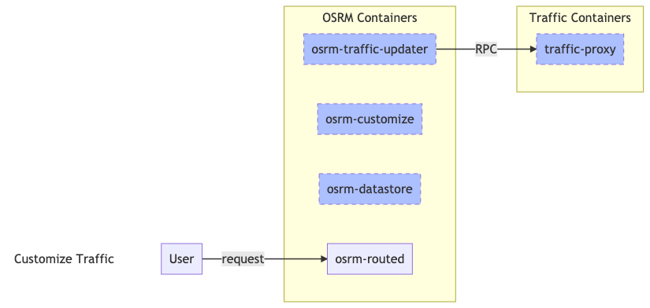
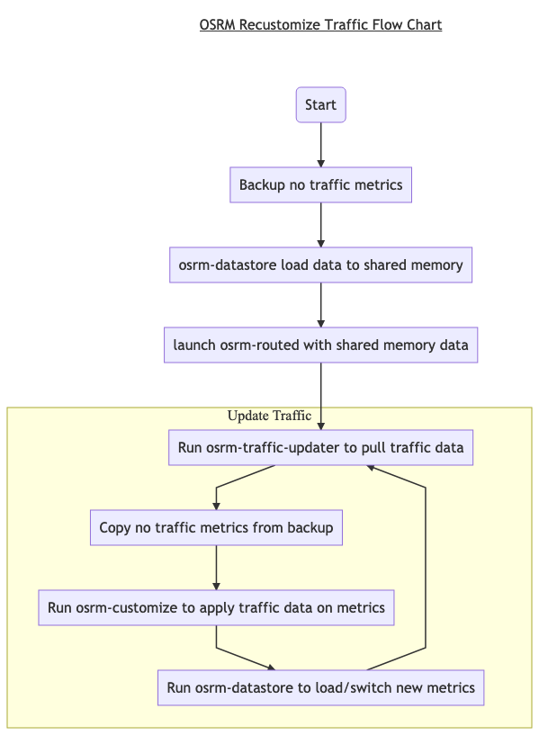
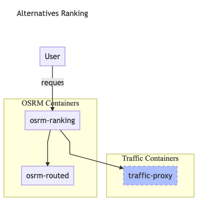

# OSRM with Telenav Traffic
There're several ways to apply telenav traffic on OSRM.     

- Re-customize Traffic   
  - fetch traffic 
  - `osrm-customize` to customize traffic into OSRM data 
  - `osrm-datastore` to switch new metric via shared memory
  - looping
- Alternatives ranking    
  - calculate `N` alternatives
  - calculate `weight/duration` for these `N` alternatives 
  - ranking by `weight` to get best one(or several)

## Recustomize Traffic  
This is the official way that provided by OSRM to integrate traffic data, see details in [OSRM Traffic](https://github.com/Project-OSRM/osrm-backend/wiki/Traffic).    
With command line tool `osrm-customize`, traffic data can be applied to OSRM compile data directly, and we can use tool `osrm-datastore` to enable the new data for `osrm-routed`. For `NA` it needs about `10~15` minutes for the whole process. It's still valuable even it's too slow for us (see more details in [#30](https://github.com/Telenav/osrm-backend/issues/30)).     

### Architecture   

- [new tool] osrm-traffic-updater
  - It's used to pull live traffic data from `traffic-proxy` by `RPC`, then convert contents to `OSRM` required `csv` format and then dump to file.

- [new service] traffic-proxy
  - It's a traffic side service provides live traffic data by `RPC`.

### Recustomize Traffic Container Flow

## Alternatives Ranking

The idea is adding a ranking proxy service(we name it `osrm-ranking`) at the front of `osrm-routed`, then dynamic apply traffic for each route request:     
  - calculate `N` alternatives
  - calculate `weight/duration` for these `N` alternatives 
  - ranking by `weight` to get best one(or several)

OSRM project discusses it a lot, see more details in [#76](https://github.com/Telenav/osrm-backend/issues/76#issue-511198359).    
We possible to achieve dynamic **live traffic & historical speed** applying by this method.      

### Architecture

### Sequence

